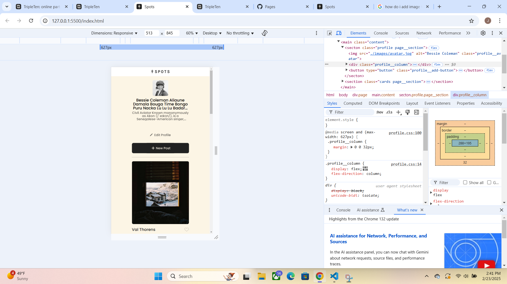

# Project Spots

### Description

This project is made so all the elements are displayed correctly on popular screen sizes that range from as high as big screen devices down to something as small as a cellphone screen.

To code this project I used VSCode which included importing photos, structuring the files for ease of use, coding the HTML and CSS from scratch as well. Figma to get the dimensions and imagaes of the project and finally pushing updates continiously through Github using terminal commands.

Inspect has become a great tool for me as it helps me edit without a concrete commit until i find the correct solution.
heres an example--> 

**Figma**

- [Link to the project on Figma] https://jadams2829.github.io/se_project_spots/
